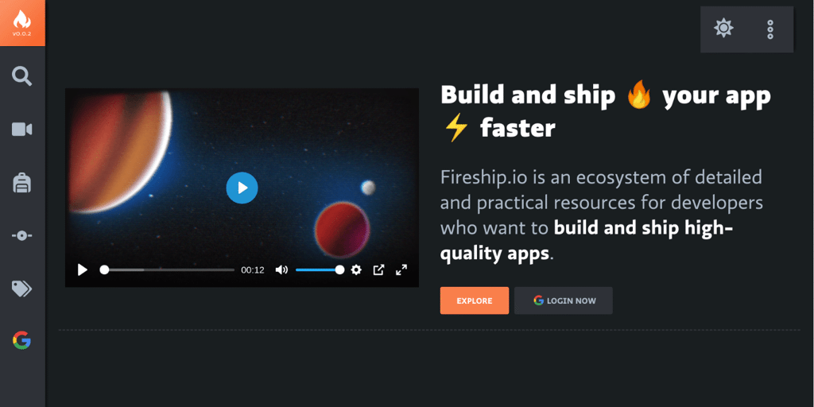

在被椒老师最近半年每几天就出一篇博客的轰炸下，我也终于动了折腾静态博客的心。老实说，Hugo还是挺复杂的，真的新手不友好，经常docs里面提到的code，我往哪里放都不知道。最搞不定的就是图片，折腾了老半天还是显示不出来，各种路径不对头...

testing embedded shortcode 


the only image that has worked so far...

testing youtube:
