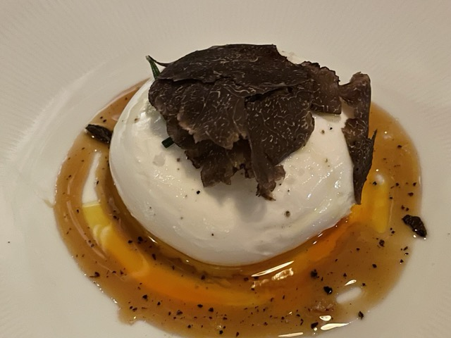

## Fine Dining
### [Grandmaster Recorders in WeHo](https://grandmasterrecorders.com/)

這間餐廳是一個當年很厲害的老錄音室改造而成的，從David Bowie到Kanye West都在這裏錄過音，雖然現在是完全看不到錄音室的痕跡了。廚房團隊都是澳洲來的，所以可以感覺很自然食材主導。在這家吃到了這個burrata配油潑辣子和蜂蜜的完美組合，實在是高！這間今年二月和八月一共去了兩次，兩次之間菜單改了不少，所以不知道現在再去吃是什麼菜單了。價格也挺合適的作爲fine dining餐廳來說。樓頂還有bar，可以露天喝酒～

### [n/soto in West Adams](https://n-soto.com/)

這間是n/naka餐廳團隊今年新開的比較accessible的日餐fusion，其實沒有特別驚豔啦，但是味道和食材新鮮度都是很on point的。因爲訂不到n/naka所以吃吃這家也不錯。n/naka自從上了Chef’s table之後就好難訂啊…

### [Hatchet Hall in Culver](http://www.hatchethallla.com/)

這家的菜也是非常好吃，但是最驚豔的是這個corn bread，吃完直接想再來一個！他們家patio非常舒服，裏面還有個long bar和一個lounge，是個可以吃完飯繼續hang out一晚上的地方。

### [Tesse in WeHo](https://www.tesserestaurant.com/)
這家是法餐，menu不大但是很精選。吃這間餐廳正好碰上DineLA的deal，很划算，包括了所有的top dish，都很好吃沒有踩雷的，算是很良心的dineLA menu了。最後這個主菜的豬排真的是驚爲天人，沒吃過這麼好吃這麼嫩的🐷

### [Formosa Cafe in WeHo](https://theformosacafe.com/)
這間supposedly臺灣fusion，但是菜絕對不是正宗的臺灣菜，不過也是好吃的。但是主要來看看裝飾和瞭解一下old Hollywood的歷史，也非常有意思。餐廳裏還有一節老式火車車廂，也可以坐在裏面吃。這裏也是無數電視電影的取景地，最近的就有Euphoria和Chippendales。

### [Honorary mention: Little Mad in NYC](https://www.littlemadnyc.com/)

這間不在LA在紐約，是今年五月家屬請我吃的生日宴～ 做的是Koarean fusion，餐廳藏在一個小巷子裏特別 low key 但是真的非常好吃，waiter小哥也非常會推薦，他介紹的每道菜都真的很好吃。一般來說如果一個餐廳的服務員自己都試吃過自家所有的菜我會覺得比較靠譜。這道放在洋蔥裏的湯真的是太可愛了～

## Casual Dining
### Pine and Crane in Silver Lake

這間是口味還挺正宗的臺灣菜，但是環境非常cater to 老外，所以成了Silver Lake的網紅店。最近還在DTLA開了個早餐店。味道好吃，但是略貴。

### Hoy Ka in Hollywood

我泰國同學推薦的非常正宗的泰國菜店，吃到了這種泰國小麪。也有其他更常見的咖喱炒飯炒粉啥的，之後再去試。

### JJ Cafe in Monterey Park

這間是聽Jimmy O Yang在他的youtube視頻裏推薦的，說是他小時候常跟家人去吃的，菜色是港式西餐，餐牌也是非常古早。我點了我的最愛：黑椒雞扒飯，真是yyds! 香港人做的黑椒汁anything我都🉑，香港人煎雞扒我也是非常🉑。我們還吃了湯通粉，也很不錯。推薦對港式西餐有些情結的人來吃～

### Kazunori in Marina del Rey 

這家是我們住在Marina的時候重複點擊率最高的外賣（因爲堂事總是排老長老長的隊… 甚至我們在紐約看到的分店也是大排長龍… ）勝在食材新鮮，而且芥末都是現磨的，我們最常點的combo就是一個roll set和toro rice。

### Porto's in West Covina

從Lake Arrowhead回城的路上去買了大名鼎鼎的Porto's，一到家就感嘆買少了，難怪人家都一打打的買。實在是太價廉物美了～ 不過Porto's的網站上也可以買半成品寄回家自己烤，吃多少烤多少更方便～

### Lunasia in Cerritose

這家的點心我覺得還不錯，裝潢比較現代類似在上海飲茶的餐廳的感覺吧。因爲是過年期間去的所以還買了做好的芋頭糕和蘿蔔糕回家，質量也是很不錯。不過最近看到象友說Pasadena那家的腸粉不行，估計每家店的品控還有點不一樣。

### Fifty One in Culver Downtown

意外的發現這家在Culver的給老外吃的fancy中國餐廳每週日有點心半價！而且質量也還不錯。衝着這麼便宜的價格我們今年去了好幾次，還帶各種朋友去。每次拿到賬單都要感嘆一下：太便宜了！

### Furaibo on Sawtelle

這家的水準從我還在UCLA讀書的時候就沒有變過。是個非常棒的居酒屋。還有關西雞翅～
